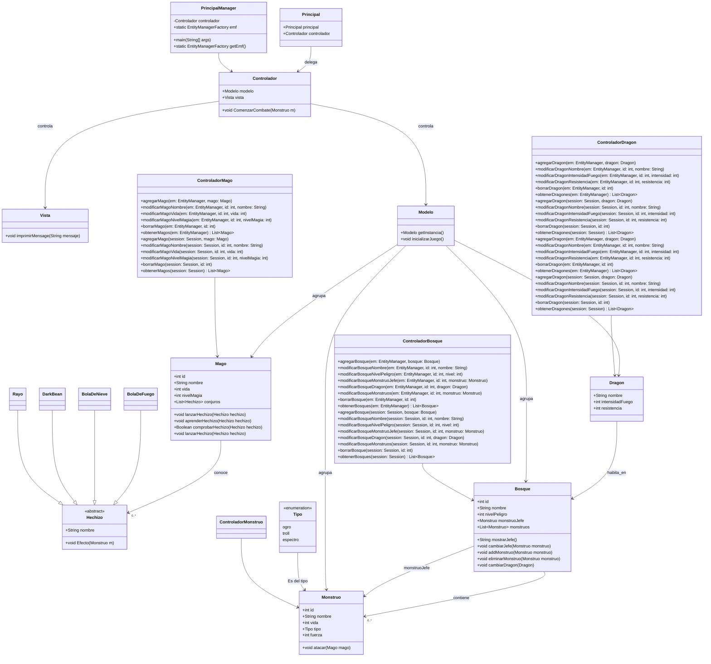
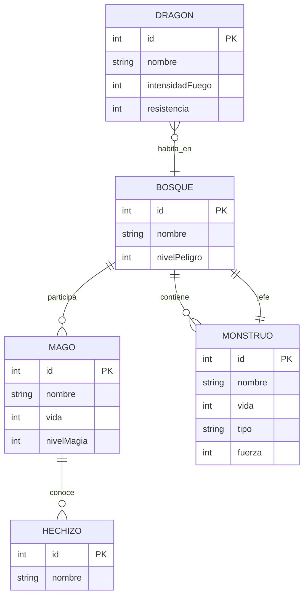

# Projecto Dragonlandia
## Introducción

Es un projecto sencillo utilizando hibernate para crear unas tablas, introducir datos, y hacer una simulación de combate pequeña.

## Mejoras y cambios futuros para Dragolandia

1. **Más hechizos y efectos:** Añadir hechizos nuevos con distintos efectos (por ejemplo curación o paralizar varios enemigos).  

2. **Nuevos tipos de monstruos y dragones:** Introducir enemigos con habilidades especiales o resistencia distinta para hacer el juego más variado.  

3. **Guardar y cargar partidas:** Implementar la opción de guardar la partida y los datos en un fichero. 

5. **Estadísticas y ranking:** Mostrar estadísticas de los magos, monstruos y dragón al final del juego, como número de ataques o daño hecho.  

6. **Implementar un menu:**: Esto permite una mejor vista.

## Análisis
### **Diagrama de clase de dragolandia**

## Diseño
### Entidad relacion:
