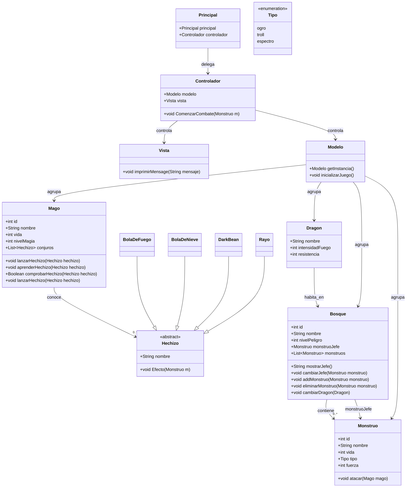

# Projecto Dragonlandia
## Introducción

Es un projecto sencillo utilizando hibernate para crear unas tablas, introducir datos, y hacer una simulación de combate pequeña.

## Análisis
### **Diagrama de clase de dragolandia**

## Diseño
### Entidad relacion:
